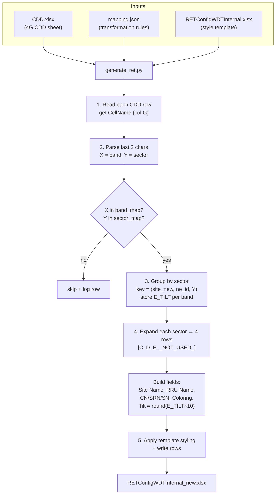

# RET Config Generation Workflow

How `RETConfigWDTInternal_new.xlsx` is produced from `CDD.xlsx` + `mapping.json`.

## Inputs

- **`CDD.xlsx`** — source 4G cell data (sheet `IMG_8289 (4G CDD)`)
- **`mapping.json`** — the transformation rules (band/sector lookups, field templates)
- **`RETConfigWDTInternal.xlsx`** — used as a *style template* (header + formatting), not as data
- **`generate_ret.py`** — the script that runs it all (uses `openpyxl`)

## Flowchart



## ASCII version

```
 CDD.xlsx        mapping.json     RETConfigWDTInternal.xlsx
 (source data)   (rules)          (style template)
     |               |                   |
     +-------+-------+-------------------+
                     |
                     v
            +-------------------+
            |  generate_ret.py  |
            +-------------------+
                     |
   (1) Read CellName (col G) from each CDD row
                     |
   (2) Parse:  X = 2nd-to-last char  -> band
               Y = last char         -> sector
                     |
   (3) Valid X & Y? --no--> skip + log
                     | yes
   (4) Group by sector key = (site_new, ne_id, Y)
       store E_TILT per band
                     |
   (5) Expand each sector -> 4 device rows
       [ C , D , E , _NOT_USED_ ]
                     |
       Build row fields:
         Site Name = {site_new}_{ne_id}
         RRU Name  = {site}_{ne}_{band}_{sector}{slot}
         RRU CN=0  RRU SN=0  RRU SRN=60..63
         Coloring  = band color (Lb1/CLb2/CRb3/Rb4)
         RCU Tilt  = round(E_TILT * 10)
                     |
   (6) Copy template styling + write rows
                     v
        RETConfigWDTInternal_new.xlsx
```

## Lookup rules (from `mapping.json`)

`X` = 2nd-to-last char of CellName (band), `Y` = last char (sector).

| `X` | Band | Color | Slot |
|-----|------|-------|------|
| `C` | L1800 | `Lb1` | `_1` |
| `D` | L1800 F2 | `CLb2` | `_2` |
| `E` | NSN_U2100 | `CRb3` | `_1` |
| `_NOT_USED_` | NOT_USED | `Rb4` | `_2` |

| `Y` | Sector | RRU SRN |
|-----|--------|---------|
| `A` | S1 | 60 |
| `B` | S2 | 61 |
| `C` | S3 | 62 |
| `D` | S4 | 63 |

Rows with an unknown `X` or `Y` are **skipped and logged**.

## Field generation

- **Site Name** = `{site_new}_{ne_id}`
- **RRU Name / Device Name** = `{site_new}_{ne_id}_{band_token}_{sector_id}{slot}`
- **RRU CN** = 0, **RRU SN** = 0, **RRU SRN** = sector's SRN
- **RCU Coloring** = band color
- **RCU Tilt** = `round(E_TILT × 10)` (degrees → 0.1° units); the `_NOT_USED_` row gets tilt `0`

## Run

```bash
cd /home/lochuynh/01.Claude/01.RET
uv run generate_ret.py
```

The script prints the number of rows written and any skipped CDD rows.
